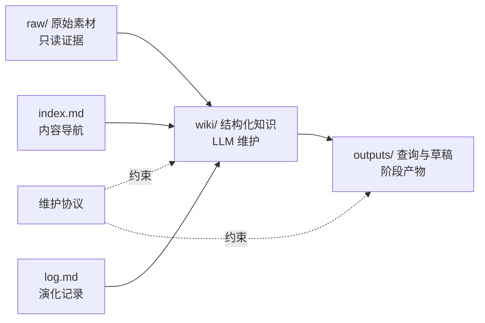
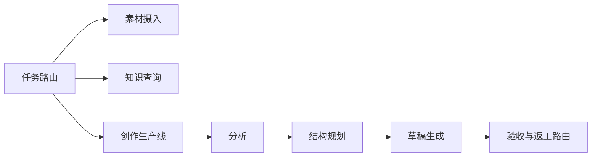

# LLM-Wiki：面向内容创作的个人知识库与工作流

> 一个由 LLM 持续维护的 Markdown 知识库框架：将不可变素材编译为可链接的知识，再按任务路由转化为查询结果和内容产物。

本仓库的公开部分展示架构、维护协议与脱敏示例；真实素材、写作技巧、方法论、项目草稿、日志和个人信息均被忽略，不会提交到 GitHub。

## 它解决什么问题

内容创作中的资料通常分散在网页剪藏、课程笔记、作品案例和历史草稿中。即使借助普通 RAG 或文件问答，也常要在每次提问时重新检索、拼接和判断，难以让一次分析成为下一次创作的起点。

这个系统把“资料处理”从一次性对话变成持续运行的知识生产过程：

| 常见问题 | 系统处理方式 |
| --- | --- |
| 原始资料越来越多，难以复用 | 原始资料只做证据，提炼后的结论进入可链接的 wiki。 |
| 同一个问题反复问、反复找 | `index.md` 先定位页面，查询结果可继续沉淀。 |
| 创作时上下文太长、任务混在一起 | 任务路由只调用当前需要的工作流，并在环节之间传递摘要。 |
| 草稿质量不稳定、修改没有方向 | 将分析、结构、草稿、验收拆开，验收失败时回到对应阶段。 |

## 核心理念

普通的文档问答会在每次提问时重新检索和拼接资料。LLM-Wiki 的做法不同：新素材进入后，AI Agent 会读取、提炼、更新相关页面、维护链接，并同步索引和日志。知识不是一次性回答，而是持续累积的 Wiki。

使用者负责选择素材、判断方向和提出问题；AI Agent 负责整理、链接、归档与维护。

这不是一个“把所有文件上传给模型”的项目，而是一套由 Agent 维护的持久化知识结构：页面之间的关联、来源、冲突和阶段结论都会随使用逐步积累。

## 架构

| 层级 | 目录 | 职责 |
| --- | --- | --- |
| 原始层 | `raw/` | 保存文章、笔记、转录或其他原始证据；只进不改。 |
| 知识层 | `wiki/` | 保存由 AI Agent 维护的概念、实体与综合流程页面。 |
| 输出层 | `outputs/` | 保存查询报告、项目骨架和内容草稿；允许迭代与丢弃。 |

除三层目录外，还有三个轻量控制面：

- `AGENTS.md`：规定 Agent 的职责、目录边界、词条格式和工作流调用顺序；它相当于知识库的运行 schema。
- `index.md`：内容目录。查询先看索引，再进入少量相关页面，避免在整个库里盲目漫游。
- `log.md`：时间线。记录摄入、查询沉淀、规则调整和健康检查，便于回溯知识库如何演化。

## 内容创作扩展

在基础 LLM-Wiki 之上，本项目增加任务路由与创作生产线：

### 五类工作流

公开工作流文档位于 [`docs/工作流/`](docs/工作流/)。它们保留了项目的调度逻辑与交付物边界，不公开具体写作技巧、风格规则或私有方法论。

| 工作流 | 适用场景 | 主要交付物 |
| --- | --- | --- |
| [素材摄入](docs/工作流/素材摄入工作流.md) | 新资料进入知识库 | 页面更新、链接、索引和日志记录 |
| [知识查询](docs/工作流/知识查询工作流.md) | 回答概念、体系或资料定位问题 | 带来源的综合回答与沉淀建议 |
| [结构分析](docs/工作流/结构分析工作流.md) | 将复杂材料拆成可复用的结构化信息 | 节点/主题摘要、约束与信息缺口 |
| [内容生成](docs/工作流/创作生产线.md) | 将确认的结构转成大纲或草稿 | 可审阅的内容产物 |
| [验收与返工](docs/工作流/成稿验收与返工路由.md) | 检查交付是否符合目标 | 通过结论或明确返工方向 |

### Agent 如何工作

1. **路由**：先识别这是摄入、查询、分析、生成还是验收任务，不把所有规则一次性塞进上下文。
2. **读取**：先读取索引和当前阶段需要的页面；只有证据不足时才回到原始素材。
3. **交付**：每个环节输出结构化摘要，例如问题定义、资料清单、结构骨架或验收结论。
4. **传递**：下一环只接收必要交付物，而不继承全部原文与聊天记录。
5. **沉淀**：稳定结论回写 wiki；一次性结果进入 `outputs/`；发现问题则进入返工或健康检查。

## 可复制模板

[`public-template/`](public-template/README.md) 是不含真实资料的独立模板，包含：

- `AGENTS.md`：通用维护协议；
- `raw/`、`wiki/`、`outputs/`：说明文件和目录骨架；
- `index.md`、`log.md`：可直接复制的索引与日志起点；
- `examples/虚构阅读笔记/`：完全虚构的 `raw → wiki → outputs` 最小示例。

## 公开范围

本仓库只公开架构、脱敏工作流和虚构示例；真实素材、知识内容、创作产物、本地配置与个人信息均不纳入版本控制。发布前可按 [`docs/隐私发布清单.md`](docs/隐私发布清单.md) 审核暂存区。

## 快速开始

1. 复制 [`public-template/`](public-template/README.md) 到新的私有或公开项目。
2. 用 Obsidian 打开模板，并阅读其中的 `AGENTS.md`、`index.md` 和工作流页面。
3. 在私有 `raw/` 中放入自己的素材，保留来源、日期和原始上下文。
4. 告诉 AI Agent 按摄入流程建立或更新 wiki，并检查链接、索引和日志。
5. 通过任务路由进行查询、结构分析、草稿生成或验收；将可复用结论重新沉淀。

## 灵感来源

本项目受 [Andrej Karpathy 的 LLM Wiki](https://gist.github.com/karpathy/442a6bf555914893e9891c11519de94f) 启发：原始资料不变，由 LLM 维护可持续积累、可互相链接的 Wiki。这里在该范式上增加了面向内容创作的输出层和任务路由机制。

## 许可

本项目采用 [MIT License](LICENSE)。框架可复用；请勿公开提交他人的私有资料、受版权保护的内容或个人信息。
