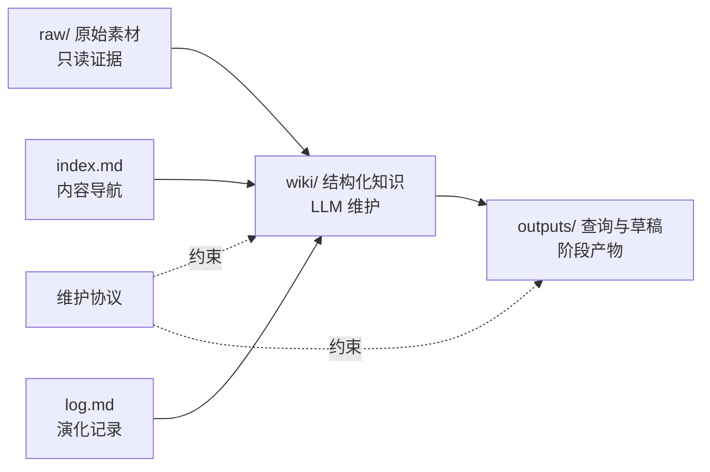
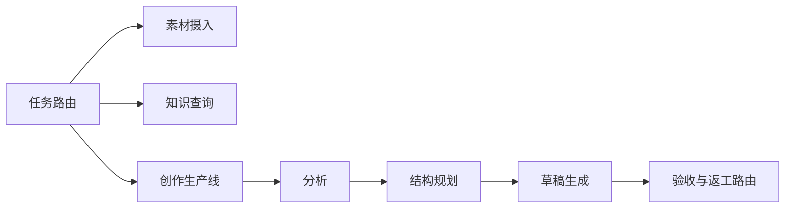

# LLM-Wiki：面向内容创作的个人知识库与工作流

> 一个由 LLM 持续维护的 Markdown 知识库框架：将不可变素材编译为可链接的知识，再按任务路由转化为查询结果和内容产物。

本仓库的公开部分展示架构、维护协议与脱敏示例；真实素材、写作技巧、方法论、项目草稿、日志和个人信息均被忽略，不会提交到 GitHub。

## 核心理念

普通的文档问答会在每次提问时重新检索和拼接资料。LLM-Wiki 的做法不同：新素材进入后，AI Agent 会读取、提炼、更新相关页面、维护链接，并同步索引和日志。知识不是一次性回答，而是持续累积的 Wiki。

使用者负责选择素材、判断方向和提出问题；AI Agent 负责整理、链接、归档与维护。

## 架构

| 层级 | 目录 | 职责 |
| --- | --- | --- |
| 原始层 | `raw/` | 保存文章、笔记、转录或其他原始证据；只进不改。 |
| 知识层 | `wiki/` | 保存由 AI Agent 维护的概念、实体与综合流程页面。 |
| 输出层 | `outputs/` | 保存查询报告、项目骨架和内容草稿；允许迭代与丢弃。 |

## 内容创作扩展

在基础 LLM-Wiki 之上，本项目增加任务路由与创作生产线：

公开工作流文档位于 [`docs/工作流/`](docs/工作流/)，只说明阶段职责和交付物，不公开具体写作技巧、风格规则或私有方法论。

## 可复制模板

[`public-template/`](public-template/README.md) 是不含真实资料的独立模板，包含：

- `AGENTS.md`：通用维护协议；
- `raw/`、`wiki/`、`outputs/`：说明文件和目录骨架；
- `index.md`、`log.md`：可直接复制的索引与日志起点；
- `examples/虚构阅读笔记/`：完全虚构的 `raw → wiki → outputs` 最小示例。

## 隐私边界

- 不提交 `raw/` 中的真实素材。
- 不提交真实概念/实体页面、实际草稿、查询报告或本地日志。
- 不提交 `.obsidian/` 工作区数据、缓存、密钥、账号信息、简历或个人联系方式。
- 发布前按照 [`docs/隐私发布清单.md`](docs/隐私发布清单.md) 审核暂存区。

## 快速开始

1. 复制 [`public-template/`](public-template/README.md) 到新的私有或公开项目。
2. 用 Obsidian 打开模板，并阅读其中的 `AGENTS.md`。
3. 在私有 `raw/` 中放入自己的素材，让 AI Agent 按摄入流程建立 wiki。
4. 使用查询与创作工作流复用已沉淀的知识。

## 灵感来源

本项目受 [Andrej Karpathy 的 LLM Wiki](https://gist.github.com/karpathy/442a6bf555914893e9891c11519de94f) 启发：原始资料不变，由 LLM 维护可持续积累、可互相链接的 Wiki。这里在该范式上增加了面向内容创作的输出层和任务路由机制。

## 许可

本项目采用 [MIT License](LICENSE)。框架可复用；请勿公开提交他人的私有资料、受版权保护的内容或个人信息。
